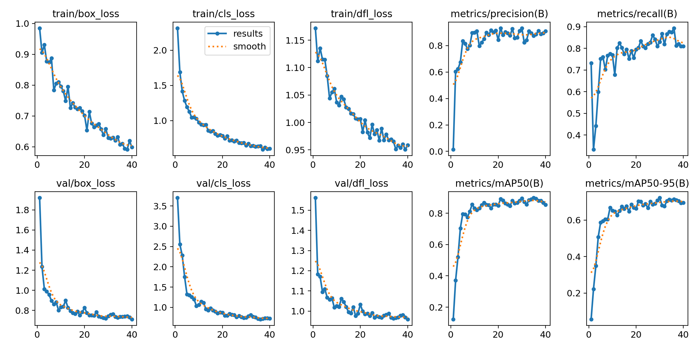
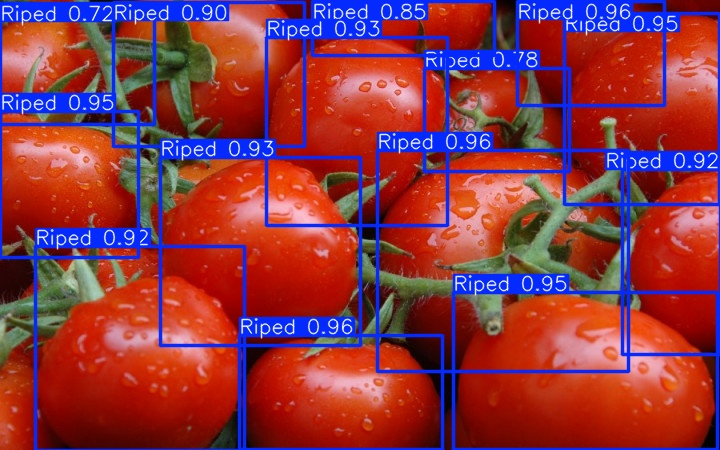

```
# 🍅 番茄成熟度检测系统（基于 YOLO11）

基于 YOLO11 目标检测算法，实现对成熟/未成熟番茄的自动识别与分类，可应用于果蔬分拣、农业采摘机器人等场景。

---

## 📌 项目简介
本项目使用自定义数据集训练 YOLO11 模型，构建了一个端到端的番茄成熟度检测系统，可自动识别图片中的番茄并标注其成熟状态。
- 模型精度：mAP@0.5 = 89.6%
- 精确率：93.7%
- 召回率：83.6%

---

## 📊 模型效果展示
### 训练过程曲线


### 检测效果示例


---

## 📂 项目结构

├── train.py # 模型训练脚本

├── test.py # 推理测试脚本

├── requirements.txt # 项目依赖清单

├── results.png # 训练过程曲线图

└── test.jpg # 实际检测效果示例

---

## 🚀 快速开始
### 1. 安装依赖环境
pip install -r requirements.txt
### 2. 模型训练
python train.py
### 3. 图片检测
python test.py

---

## 🛠️ 关键技术点

- 基于 YOLO11 的轻量级目标检测框架，兼顾精度与推理速度
- 自定义数据集标注与数据增强，提升模型泛化能力
- 早停机制防止模型过拟合，保证训练稳定性
- 模型性能评估与检测阈值优化，提升实际场景识别效果

```
